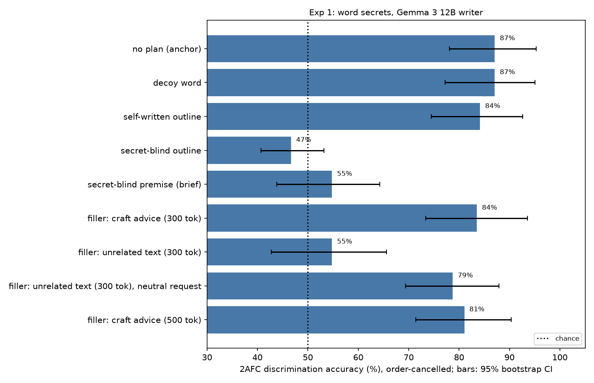
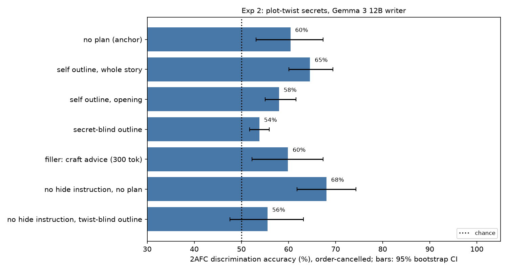
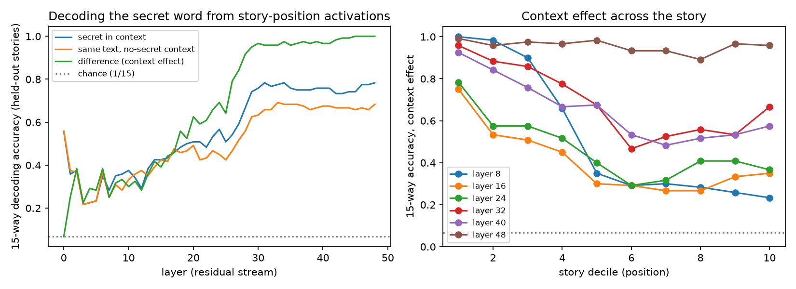
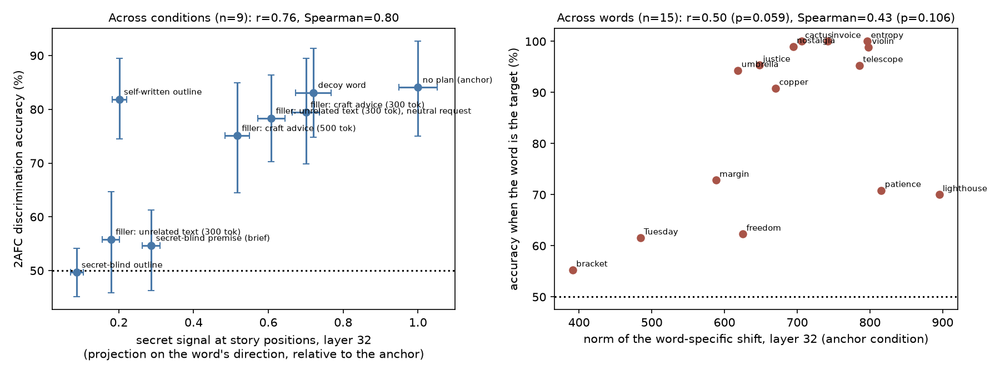
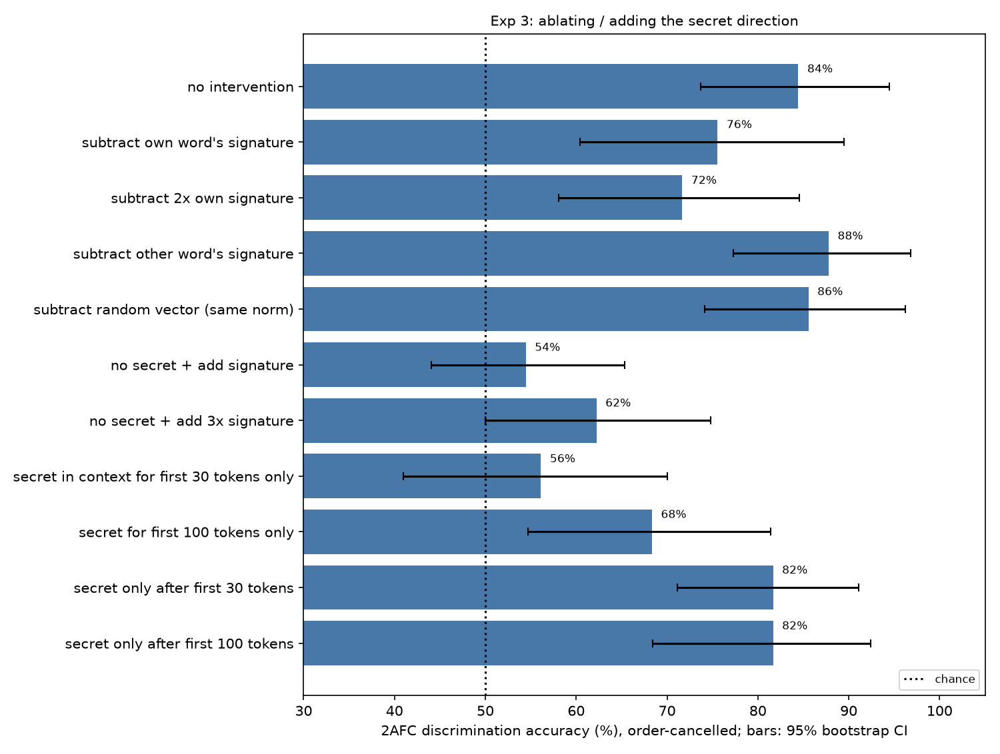

# Does a plan stop a language model from leaking a secret into its story, and what carries the leak?

White-box study on Gemma 3 12B-it, run on 2026-10-05. All numbers below come from the files in `results/`; full tables are in `results/tables_g12.md`.

## 1. Executive summary

**Question.** When a model writes a story while holding a secret it was told not to reveal, does an explicit plan reduce how much of the secret leaks into the text, and is the secret active in the model's internal state while it writes?

**Answer.** A plan removes the leak only if the plan's content was fixed without knowledge of the secret. With the plain "don't reveal" prompt, a guesser picks which of two stories was written with a given secret word 84% of the time (Holtzman & West report 83% for this model). When the story follows an outline written by the same model without the secret, that falls to 50%, which is chance. A one- or two-sentence secret-blind premise is almost as effective (55%). When the model writes its own outline while knowing the secret, the outline itself leaks (84%) and the story written from it leaks as much as with no plan (82%). Extra context that fixes no story content does little: prose-craft advice of the same token length as the outline leaves leakage at 75 to 80%, and so does unrelated expository text (78%). The paper's decoy-word mitigation did not work for this writer (83%).

**Mechanism.** The secret word can be decoded from the residual stream at story-token positions with 97 to 100% accuracy (15-way, late layers) through the whole story, in every condition, including the blind-outline condition in which the guesser is at chance. So the secret being represented does not by itself produce leakage. Removing the secret from the context after the first 30 story tokens abolishes the leak (52%), while withholding it for the first 30 or 100 tokens and then restoring it gives the full leak (81%, 78%). The leak is therefore produced continuously while the body of the story is written, not committed in the opening. Subtracting the secret's mean residual signature during generation lowers leakage by 5 to 9 points (10 points relative to subtracting another word's signature), without hurting story quality; adding the signature to a no-secret run produces little leakage. That signature is a small part of the causal story at most.

**Plot twists.** For a twist the writer knows is coming, the same pattern appears but is weaker and harder to measure: the local guesser is near its floor, and a larger external model reads the same openings at 75%. The plot-twist results are suggestive, not conclusive.

**Practical implication.** To keep known information out of generated prose, decide the content before the model sees the secret (or in a separate context) and have it write from that plan. Asking the model to plan for itself does not help.

## 2. Research question and motivation

The idea under test: models foreshadow too much because planning and prose generation are entangled, so the model "can't help but hint at what it knows is coming". If it could rely on a plan that already sets up the future, would it stop?

Holtzman & West (2026, arXiv 2605.10794) established the behavioural core with API models: a secret word leaks thematically into stories at 70 to 79% two-alternative discrimination for several frontier models, and at 83% for Gemma 3 12B. They did not test plans, plot-level secrets or internals, and called for a mechanistic study. Three gaps follow:

1. Does conditioning on a plan reduce leakage, with controls that separate "the plan fixes content" from "the plan is just more context"?
2. Does it hold for plot-level secrets?
3. Is the secret represented in the residual stream throughout generation, does its strength predict leakage, and does removing it remove leakage?

Related work that shaped the design: semantic leakage (Gonen et al. 2025); Taboo model organisms, where a fine-tuned-in word is recovered with logit lens and SAEs (Cywiński et al. 2025); the result that secrecy plus consistency needs private state (Baldelli et al. 2026); ironic rebound under negation (Mann et al. 2025); and evidence that models pre-compute future content in hidden states (Wu et al. 2024; Dong et al. 2025). `literature_review.md` has the full review.

## 3. Experimental setup

### Writer
`google/gemma-3-12b-it`, local, bf16, HuggingFace transformers 5.18.0, torch 2.14.1, one NVIDIA RTX A6000 (48 GB). Sampling at temperature 1.0 with the model's default top-k 64 and top-p 0.95; up to 900 new tokens per story. Seeds are fixed in each script (base seed 42).

### Guessers
The plan was to use API models through OpenRouter. On the run day every paid model returned HTTP 402 (the account had no credits left), so the guessers are:

- **Primary: Gemma 3 12B-it itself, local** (`src/local_judge.py`). The 2AFC prompt is the one from Holtzman & West; the answer is read from the next-token logits of "1" and "2", which is the temperature-0 answer restricted to those two options. About 24,000 trials.
- **External cross-check: `nvidia/nemotron-3-ultra-550b-a55b:free`** through OpenRouter (the free tier allows about 1,000 requests per day; many calls failed, so 513 trials were answered).
- **Second local guesser: Gemma 3 27B-it, 4-bit**, on subsamples (Section 4.5).

### Measurement
- **2AFC discrimination (primary).** Two stories written with different secrets; "which text has the secret word X?". Each pair is shown in both orders and with both secrets as the target (4 trials per pair). Chance is 50%.
- **Order-cancelled accuracy.** For each pair and target, the pair counts as correct if the logit margin for "1" is higher when the target story is shown first than when it is shown second. A constant preference for one position cancels exactly. This was added after seeing that the guesser answered "1" in 89 to 96% of the plot-twist trials, which makes per-trial accuracy almost uninformative there. Both metrics are reported; they agree for word secrets.
- **2AFC detection.** A story with a secret against a story with none.
- **Guesser-free check.** Nearest-centroid 15-way decoding of the secret from the mean residual activation of the story text read under a no-secret context (so it uses only the text), leave-one-repetition-out. Chance is 6.7%.
- **Statistics.** 95% confidence intervals from a cluster bootstrap over the 15 secret words (12 premises in Exp 2), 5,000 resamples; differences between conditions from a paired bootstrap over the same clusters; Holm correction within each experiment's family of contrasts. Bootstrap p-values have a floor of 0.0002.

### Exp 1: word secrets (15 curated words from Holtzman & West, 8 stories per word and condition, 120 stories per condition)
The secret is always in the system prompt with the paper's wording: "Your secret word is 'X'. Do not mention this word, reference it, or hint at it in any way. Keep it completely hidden." All plan and filler conditions use one format: a first user request, an assistant text, then the request for the story.

| Condition | Turn-1 assistant text | Story request |
|---|---|---|
| `dont_reveal` (anchor) | none | paper's: "Write a short story (5–8 paragraphs)…" |
| `decoy` | none; paper's decoy prompt | same |
| `plan_self` | outline written by the model with the secret in context | "Now write the short story … following your outline." |
| `plan_blind` | outline written by the model with no secret, transplanted | same |
| `plan_brief` | one- or two-sentence premise written with no secret | "… based on your premise." |
| `filler_craft` / `filler_craft_long` | generic prose-craft advice, no secret (about 300 / 500 tokens) | "Now write a short story (5–8 paragraphs)." |
| `filler_irrelevant` | unrelated expository text (about 300 tokens) | "Now, on to a different task. Write a short story…" |
| `filler_irrelevant_plain` | the same unrelated texts | "Now write a short story (5–8 paragraphs)." |
| `no_secret` | none | paper's |

`plan_self` and `plan_blind` differ only in whether the outline was written with the secret in context. Both kinds of outline ran into the 500-token cap, so `filler_craft_long` (also capped at 500 tokens) is the token-matched control. `filler_craft_long` and `filler_irrelevant_plain` were added after the first results, to close a length mismatch and a wording confound that I had introduced.

### Exp 2: plot-twist secrets
12 premises with 4 candidate final-scene twists each, written for this study (`datasets/twists/twists.json`). The writer is told the premise and that "the story has a secret twist that is only revealed in its final scene", told not to reveal or hint at it, and asked to write only the opening (4–6 paragraphs). Three openings per premise, twist and condition (144 per condition). Trials pair two openings with the same premise and different twists, so anything guessable from the premise alone cancels; detection trials pair a twist opening with a no-secret opening for the same premise.

Conditions: `base`; `plan_self_full` (the model outlines the whole story including the final scene, then writes the opening); `plan_self_open` (outlines only the opening, knowing the twist); `plan_blind` (twist-blind outline of the opening); `filler_craft`; and, added later, `open_base` and `open_plan_blind`, in which the writer knows the twist but gets **no** instruction to hide it (natural foreshadowing).

### Exp 3: mechanism (word secrets)
- **Readout.** Each Exp 1 story is run through the model twice: under its real context and under a control context in which only the system prompt is replaced by the no-secret one. The difference at story positions ("context effect") removes whatever the text itself carries. Decoding and strength are computed on that difference.
- **Interventions**, 6 new stories per word (90 per condition), described in Section 4.4.

### Cost
API cost: $0 (free tier only). GPU: about 8.5 hours on one A6000. Generation used batches of 32 (22 for two-turn prompts); the guesser ran at about 2 trials per second.

## 4. Results

### 4.1 Exp 1: a plan helps only if it was written without the secret

| Condition | Discrimination % [95% CI] | Order-cancelled % | Text-only decoding % (chance 6.7) | Turn-1 tokens | Story words |
|---|---|---|---|---|---|
| No plan, anchor (`dont_reveal`) | 84.1 [75.0, 92.6] | 87.1 | 66 | 0 | 524 |
| Decoy word (`decoy`) | 83.1 [74.8, 91.4] | 87.1 | 62 | 0 | 522 |
| Self-written outline (`plan_self`) | 81.9 [74.5, 89.5] | 84.2 | 61 | 500 | 631 |
| **Secret-blind outline (`plan_blind`)** | **49.7 [45.1, 54.1]** | 46.7 | 7 | 500 | 680 |
| Secret-blind premise (`plan_brief`) | 54.7 [46.3, 61.3] | 54.8 | 6 | 52 | 655 |
| Filler: craft advice, 300 tokens (`filler_craft`) | 79.5 [69.9, 89.5] | 83.5 | 48 | 301 | 537 |
| Filler: craft advice, 500 tokens (`filler_craft_long`) | 75.1 [64.4, 84.9] | 81.0 | 38 | 500 | 554 |
| Filler: unrelated text, neutral request (`filler_irrelevant_plain`) | 78.3 [70.3, 86.4] | 78.8 | 44 | 302 | 518 |
| Filler: unrelated text, "on to a different task" (`filler_irrelevant`) | 55.8 [45.9, 64.7] | 54.8 | 13 | 302 | 525 |

Trials per condition: 960 (1,440 for the anchor). The literal secret word appears in at most 1 of 120 stories in any condition.

Contrasts (per-trial accuracy, points; paired bootstrap over words):

| Contrast | Difference [95% CI] | p | Holm p |
|---|---|---|---|
| blind outline − anchor | −34.4 [−44.9, −24.1] | 0.0002 | 0.003 |
| self outline − anchor | −2.2 [−9.1, +6.8] | 0.50 | 1 |
| blind premise − anchor | −29.4 [−42.3, −19.4] | 0.0002 | 0.003 |
| craft filler (300) − anchor | −4.6 [−9.6, +0.2] | 0.06 | 0.37 |
| craft filler (500) − anchor | −9.0 [−17.3, −1.7] | 0.016 | 0.11 |
| unrelated filler, neutral request − anchor | −5.8 [−14.0, +2.6] | 0.15 | 0.59 |
| unrelated filler, "different task" − anchor | −28.3 [−40.9, −17.9] | 0.0002 | 0.003 |
| decoy − anchor | −1.0 [−10.4, +9.8] | 0.85 | 1 |
| blind outline − craft filler (500, token-matched) | −25.4 [−36.6, −12.3] | 0.0002 | 0.003 |
| self outline − blind outline | +32.2 [+22.3, +40.8] | 0.0002 | 0.003 |
| "different task" wording: neutral − original | +22.5 [+14.2, +30.7] | 0.0002 | 0.003 |

What this shows:

1. **The anchor replicates.** 84.1% here against 83% reported for Gemma 3 12B. Detection against no-secret stories is 79% per trial (84% order-cancelled).
2. **Fixing content removes the leak; adding context does not.** The blind outline is 25 points below the token-matched craft filler and 34 below the anchor, and sits at chance. Token-matched filler costs the leak 9 points at most. This is the comparison the outline-versus-dilution confound called for.
3. **A very small amount of fixed content is enough.** A 52-token premise brings leakage to 55%.
4. **A self-written plan moves the leak into the plan.** The outlines written with the secret in context can be told apart at 83.8% [77.9, 89.7], and the stories written from them at 81.9%. Many of these outlines say what they are doing: for "invoice" one opens with "here's the outline for a short story, designed to avoid any connection to the target word", titles the story "The Baker's Ledger" and gives its theme as "the importance of meticulous record-keeping".
5. **A task-boundary cue also removes the leak.** With unrelated text followed by "Now, on to a different task", leakage is 56%. With the same texts and the neutral request it is 78%. So the effect comes from the wording, not from the intervening text. In that condition 84% of stories are the lighthouse-keeper story that this model writes in 100% of no-secret runs (27% in the anchor): the model behaves as if the secret belonged to the earlier task.
6. **The decoy did not help this writer.** The real secret stays at 83.1% (83.5% after dropping pairs in which the other story's decoy is the target word), and the decoy word itself is only weakly detectable (55.9% [47.7, 64.1]). Holtzman & West report that a decoy takes Llama's real secret to chance; that does not carry over to Gemma 3 12B.

The text-only decoding column, which uses no guesser, orders the conditions the same way.

Per-word accuracies are in `figures/exp1_per_word_g12.png`. In the anchor they range from 55% (bracket) to 100% (entropy, invoice, cactus), which is why the word-level confidence intervals are wide.

### 4.2 Exp 2: plot twists

| Condition | Order-cancelled discrimination % [95% CI] | Per-trial % | Share of "1" answers % | Detection vs no-secret, order-cancelled % [95% CI] |
|---|---|---|---|---|
| Hide instruction, no plan (`base`) | 60.4 [53.1, 67.4] | 55.0 | 92 | 31.9 [23.6, 40.3] |
| Self outline of whole story (`plan_self_full`) | 64.6 [60.1, 69.4] | 55.6 | 89 | 45.1 [37.5, 53.5] |
| Self outline of opening (`plan_self_open`) | 58.0 [55.0, 61.6] | 53.0 | 90 | 35.4 [22.9, 49.3] |
| Twist-blind outline (`plan_blind`) | 53.8 [51.7, 55.9] | 51.3 | 96 | 50.7 [38.2, 63.2] |
| Craft filler (`filler_craft`) | 59.9 [52.3, 67.4] | 55.6 | 89 | 38.2 [27.1, 49.3] |
| No hide instruction, no plan (`open_base`) | 68.1 [61.8, 74.3] | 60.6 | 89 | not run |
| No hide instruction, twist-blind outline (`open_plan_blind`) | 55.6 [47.6, 63.2] | 51.9 | 95 | not run |

1,152 discrimination trials per condition (576 for the two `open_` conditions) and 288 detection trials.

- **The local guesser is close to its floor and strongly position-biased here.** It answers "1" about 90% of the time, so only the order-cancelled column is informative. On the same `base` trials the external model scores 74.8% (n = 238, Wilson interval 68.9 to 79.9) where the 12B guesser scores 55.0% per trial. Twist leakage is real but the 12B guesser sees only part of it.
- **Direction of the plan effect matches Exp 1.** The twist-blind outline gives the lowest discrimination in both regimes: 53.8 against 60.4 with the hide instruction (difference −6.6 [−13.2, +0.2], p = 0.06) and 55.6 against 68.1 without it (−12.5 [−22.2, −1.4], p = 0.03, Holm 0.20). The external model gives 62.8% for `plan_blind` (n = 94) against 74.8% for `base` (p of about 0.03 in a two-proportion test without clustering), and the 27B guesser shows a drop of about 10 points in both regimes (Section 4.5). No single test survives correction, but three guessers and two regimes point the same way, and the outline does not bring twist leakage to chance for the two stronger guessers.
- **A self-written outline that already contains the twist does not reduce leakage** (64.6 against 60.4, difference +4.2 [−2.6, +10.8]). This is the condition closest to the idea's wording, "a plan that sets up the future".
- **Under the hide instruction the opening is marked by avoidance.** In detection trials the guesser attributes the twist to the *no-secret* opening more often than to the opening written with it: 31.9% [23.6, 40.3] for `base`, below chance. Holtzman & West saw the same inversion under their "actively hide" prompt. With a twist-blind outline the inversion disappears (50.7%), though the no-secret openings in these trials were written without an outline, so that comparison is not clean.
- **Without the hide instruction the model foreshadows more** (68.1 against 60.4), as the original idea assumes.

### 4.3 Exp 3a: the secret is in the residual stream throughout, whether or not it leaks

- **Decodability.** In the anchor condition, the context effect (same text, secret context minus no-secret context) identifies the secret among 15 with 96% accuracy at layer 32 and 100% at the last layers, on held-out stories. The text alone, read without the secret, gives 66% at layer 32, so part of what a naive probe finds at story positions is the story's content; the difference isolates what the context adds.
- **Across the story.** At the final layer, accuracy is 89 to 99% in every tenth of the story. At middle layers it starts near 100% in the first tenth and settles around 30 to 55% (right panel).
- **In every condition.** Final-layer decoding is 97 to 100% in all nine conditions, including the blind-outline condition in which behaviour is at chance. At layer 32 it is 61% for the blind outline and 58% for the self outline, against 96% for the anchor.
- **Size.** The context effect is small: its norm is 1.5% of the residual norm at layer 32 in the anchor and 0.5% under an outline.
- **Activation followed by suppression of the word itself.** Through the logit lens at layer 32, the secret context raises the log-probability of the secret word's first token by 0.31 nats (other candidate words: +0.02). At the output it is 0.24 lower than under the control context while the other candidate words are 1.29 higher, a relative suppression of about 1.5 nats. The output lift is positive only in the first tenth of the story (+1.08) and negative after that.

**Does strength predict leakage?**

Strength is the projection of a story's context effect onto its word's direction (direction estimated from other stories of the anchor condition), at layer 32.

- Across the nine conditions, mean strength and discrimination accuracy correlate (Pearson 0.76, Spearman 0.80, n = 9). The blind outline has 9% of the anchor's strength and no leak; the fillers keep 52 to 70% and leak.
- The self-written outline breaks the pattern: 20% of the anchor's strength, 82% leakage. There the outline text carries the secret, so the story does not need the context signal.
- Across stories, within condition and word, the pooled correlation between strength and the story's leakage score is r = 0.23 at layer 32 and 0.25 at layer 40 (n = 1,080, p < 1e-13). In the anchor condition alone it is 0.13 (n = 120, p = 0.14), and it is absent under the blind outline (−0.05).
- Across the 15 words in the anchor condition, the norm of the word-specific shift correlates with the word's accuracy at r = 0.50 (p = 0.06).

So strength tracks leakage moderately across conditions and weakly across stories. This is correlational, and causation could run from the text to the signal: a story that has drifted towards the secret may make the model attend to the secret more.

### 4.4 Exp 3b: interventions

**Projection ablation failed.** Projecting the word's direction out of the residual stream at every layer (zero-ablation) made the model repeat a single token ("pedestrians pedestrians pedestrians…"). Clamping the projection to its no-secret baseline value at every layer was also destructive for concept directions: with the own-word direction, the "umbrella" story began "Rain umbrella, or umbrella umbrella, umbrella, umbrella", and clamping another word's direction or the 14-dimensional span of all word directions was similarly degenerate, while a random direction left the text intact. These directions carry large natural variance in this model (one residual dimension has values near 6e4), so clamping them is not a clean test. The outputs are kept in `results/exp3_smoke_clamp/` and are not analysed further.

**Mean-shift patching.** At every generated position and every layer except the last, the layer's output is shifted by minus the increment of the word's signature (the word-specific mean context effect) at that layer. This removes, on average, what the secret adds, and leaves prompt tokens untouched.

| Condition | Discrimination % [95% CI] | Order-cancelled % | Quality rating (1–9) | NLL per token | Recall of secret /15 |
|---|---|---|---|---|---|
| No intervention (`abl_none`) | 80.8 [70.3, 90.7] | 84.4 | 8.04 | 0.643 | 15 |
| Subtract own word's signature (`sub_own`) | 75.6 [62.9, 87.1] | 75.6 | 8.05 | 0.652 | 15 |
| Subtract 2× own signature (`sub_own_k2`) | 71.4 [57.1, 84.4] | 71.7 | 8.05 | 0.760 | 15 |
| Subtract another word's signature (`sub_other`) | 85.6 [75.3, 94.1] | 87.8 | 8.04 | 0.680 | 15 |
| Subtract random vector, same norm (`sub_random`) | 84.7 [74.7, 93.9] | 85.6 | 8.05 | 0.675 | 15 |
| No secret, add signature (`add_own_k1`) | 53.1 [46.8, 59.0] | 54.4 | 8.38 | 0.572 | n/a |
| No secret, add 3× signature (`add_own_k3`) | 54.4 [45.1, 63.2] | 62.2 | 8.26 | 0.818 | n/a |

360 trials per condition. Quality is rated by the un-intervened model (expected rating over the digit logits); NLL is the story's per-token negative log-likelihood under the un-intervened model.

- Subtracting the own-word signature lowers leakage by 5.3 points against no intervention (CI −16.5 to +5.8, not significant) and by 10.0 points against subtracting another word's signature (CI −17.6 to −3.4, p = 0.004, Holm 0.04). Doubling the subtraction gives −9.4 against no intervention (p = 0.07). Leakage stays far above chance in all cases.
- The effect is specific (other-word and random controls do not lower leakage) and comes without a quality cost at k = 1.
- The model can still state its secret when asked under every intervention (15 of 15).
- Adding the signature to a run with no secret gives little: 53 to 54% per trial, 62% order-cancelled at 3×.

The mean signature is therefore a minor carrier. The intervention removes the average effect at each layer; it does not stop later layers from reading the secret again from the prompt tokens, which were left untouched.

**Context swap: when must the secret be in context?** Removing the secret from the context is a complete ablation of everything it adds at later positions, with no damage to the model. The story is started under one context and continued under the other.

| Condition | Discrimination % [95% CI] | Difference from `abl_none` [95% CI] | Literal mention % |
|---|---|---|---|
| Secret throughout (`abl_none`) | 80.8 [70.3, 90.7] | | 1.1 |
| Secret for the first 30 tokens only (`swap_early30`) | 52.2 [44.2, 61.3] | −28.6 [−39.1, −17.4], p = 0.0002 | 5.6 |
| Secret for the first 100 tokens only (`swap_early100`) | 68.1 [59.0, 77.2] | −12.8 [−22.0, −3.7], p = 0.011 | 20.0 |
| Secret only after the first 30 tokens (`swap_late30`) | 80.6 [71.6, 89.2] | −0.3 [−9.6, +10.5] | 6.7 |
| Secret only after the first 100 tokens (`swap_late100`) | 77.5 [67.8, 86.6] | −3.3 [−13.3, +6.1] | 6.7 |

- **Removing the secret removes the leak.** After a 30-token opening written with the secret, a secret-free continuation is at chance.
- **The leak does not need the opening.** When the first 30 or 100 tokens are the model's default no-secret opening (a lighthouse keeper in every case) and the secret is present only afterwards, leakage is as high as with the secret throughout. The secret keeps entering through the content choices made along the way; a "cactus" story that starts with the lighthouse keeper has him build "a small garden on the leeward side of the tower".
- **By 100 tokens some of the theme is already in the text.** Leakage after removing the secret at 100 tokens is 68%, and in 20% of those stories the continuation, now free of the instruction, names the secret word outright (for "violin": "her husband, a renowned violinist"). This fits the readout result that the instruction suppresses the word at the output.

### 4.5 Cross-checks

| Check | Result |
|---|---|
| External guesser (Nemotron 3 Ultra, free tier), Exp 1 anchor | 89.4% (n = 132, Wilson 83.0 to 93.6); 12B guesser on the same trials: 81.8% |
| External guesser, Exp 1 blind outline | 63.3% (n = 49, Wilson 49.3 to 75.3, p = 0.09 against 50%); 12B on the same trials: 49.0% |
| External guesser, Exp 2 `base` / `plan_blind` | 74.8% (n = 238) / 62.8% (n = 94) |
| Gemma 3 27B (4-bit) guesser, Exp 1, 192 trials each | anchor 85.9% (Wilson 80.3 to 90.2); blind outline 41.1% (34.4 to 48.2); 12B on the same trials: 83.9% and 47.9% |
| Gemma 3 27B guesser, Exp 2, 192 trials each (per-trial; order-cancelled in brackets) | `base` 64.6% (66.7); `plan_blind` 54.2% (56.2); `open_base` 70.3% (72.9); `open_plan_blind` 60.4% (61.5). It answers "1" in 60 to 67% of these trials |
| Guesser-free text decoding | same ordering of conditions as the guesser (table in 4.1) |
| Position bias of the 12B guesser | "1" in 42 to 55% of word-secret trials; 89 to 96% of twist trials |

All three guessers agree that the blind outline removes most of the word leak. They disagree about what is left: the external model is above 50% on 49 trials (63.3%), the 27B guesser is below 50% on 192 trials (41.1%, binomial p = 0.02 without clustering), and the 12B guesser is at 49.7% (46.7% order-cancelled). A below-chance score would mean the story is recognisable by avoiding the secret, as Holtzman & West found under "actively hide". These samples cannot settle whether a small residual signal exists in either direction.

For plot twists, the 27B guesser is less position-biased than the 12B one and reads more: the twist-blind outline lowers its accuracy by about 10 points both with the hide instruction (64.6 to 54.2) and without it (70.3 to 60.4); each difference has p of about 0.04 in an unclustered two-proportion test.

## 5. Discussion

**The idea's question.** "Is it still true when it can rely on a plan that sets up the future?" The answer depends on who wrote the plan. If the model wrote it while holding the secret, the plan is where the secret went, and the prose inherits it; this holds for a word (Exp 1) and for a whole-story outline that already contains the twist (Exp 2). If the content was decided without the secret, the primary guesser and the text probe find no trace of the secret word in the prose (the cross-check guessers leave a small residual open, Section 4.5), even though the model still holds it and represents it at every story position. For plot twists the same holds in direction, with weaker evidence.

**Where the leak happens.** Not in the wording of prose whose content is fixed, and not in a single early commitment. It happens wherever the model chooses content with the secret available: at outline time, and continuously through the body of a free story. The premise condition and the swap conditions together make this point. A two-sentence premise that the model is told to write from stops the leak, while a fixed opening that the model merely continues does not.

**Dilution.** Holtzman & West speculate that "a longer, richer prompt might give the model enough material to mask the secret". Generic context of the same length as the outline changes leakage by 5 to 9 points, so length and distance are not what the outline contributes. What matters is that the story's content is specified.

**Representation versus use.** The secret is linearly present at story positions in every condition, at full decodability in late layers. Its mean signature is small, tracks leakage across conditions, and has a modest, specific causal effect. The complete ablation (taking the secret out of the context) removes the leak. The most economical reading is that the leak is driven by repeated reads of the secret from the prompt as content decisions come up, with the mean residual signature being a partial summary of those reads.

**Surprises.**
- The decoy mitigation fails for Gemma 3 12B.
- "Now, on to a different task" is as effective as a blind outline, for a different reason: the model writes its default story as if it had no secret.
- Under a hide instruction, twist openings are recognisable by what they avoid (detection below chance).
- Without a secret this model writes the same lighthouse-keeper story in every run, so a large share of the anchor's leak signal is the departure from that default.

## 6. Limitations

- **Guesser.** The primary guesser is the writer model itself, not a frontier API model, because the API account had no credits. Its sensitivity is limited, clearly so for twists. Chance-level results mean "not detectable by Gemma 3 12B or by a linear probe on its activations". The external and 27B cross-checks are small (49 to 238 trials), their intervals ignore clustering by word, and for the blind outline they point in opposite directions.
- **One writer model, one sample of words.** 15 words; word-level intervals are wide (the anchor's is 75 to 93%). Conclusions rest mainly on paired differences across the same words.
- **Post hoc additions.** The order-cancelled metric, `filler_craft_long`, `filler_irrelevant_plain`, the `open_` twist conditions and the swap experiment were added after seeing earlier results. The Holm families include them. The swap experiment is the least pre-specified and has 90 stories per condition.
- **Length and truncation.** Outlines were cut at 500 tokens. Stories written from outlines are longer (680 words against 524) and 47% of the blind-outline stories hit the 900-token cap. Longer stories give a guesser more to work with, so this works against the reported reduction.
- **Detection trials** compare against no-secret stories written without any plan, which are all lighthouse stories. Detection is reported for the anchor and, with that caveat, for Exp 2 only.
- **Twist stimuli** were written by me and not validated by humans; only openings were generated, never whole stories.
- **Interventions.** Projection ablation could not be made to work without destroying fluency, so the question "does ablating the direction remove leakage" is answered only through mean-shift patching (small effect) and context removal (full effect). Neither isolates a specific component; attention from story positions to the secret tokens was not tested. SAE features were not used.
- **Strength and leakage** are correlated, not shown to be causally linked, and the text may drive the signal.
- **Quality** of intervened stories was rated by the writer model itself.

## 7. Conclusions and next steps

A model holding a secret leaks it into the content decisions it makes, whenever it makes them. Handing it a plan helps only when the plan was made without the secret; then the leak into the prose drops to about chance for word secrets, while the secret remains fully decodable inside the model. A plan the model writes for itself absorbs the leak and passes it on. For plot twists the direction is the same and the evidence weaker.

Follow-ups, in order of value:
1. Re-judge the saved stories (`results/exp1/stories.jsonl`, `results/exp2/stories.jsonl`) with frontier guessers and with humans, especially the blind-outline and twist conditions.
2. Mask attention from story positions to the secret tokens, layer by layer, to locate the reads that the swap experiment says are necessary.
3. Run the twist experiment on whole stories with a larger writer, and score foreshadowing directly.
4. Test the two-context recipe that the results suggest: plan in a context without the secret, write in one with it.
5. Larger word sets and other writer models, to see whether the decoy failure and the task-boundary effect are specific to Gemma 3 12B.

## References

- Holtzman & West (2026). Can You Keep a Secret? Involuntary Information Leakage in Language Model Writing. arXiv:2605.10794.
- Cywiński et al. (2025). Towards eliciting latent knowledge from LLMs with mechanistic interpretability. arXiv:2505.14352.
- Baldelli et al. (2026). LLMs Can't Play Hangman. arXiv:2601.06973.
- Mann et al. (2025). Don't think of the white bear: ironic negation in transformer models. arXiv:2511.12381.
- Gonen et al. (2025). Does Liking Yellow Imply Driving a School Bus? Semantic Leakage in Language Models. arXiv:2408.06518.
- Wu et al. (2024). Do Language Models Plan Ahead for Future Tokens? arXiv:2404.00859.
- Dong et al. (2025). Emergent Response Planning in LLMs. arXiv:2502.06258.
- Arditi et al. (2024). Refusal in Language Models Is Mediated by a Single Direction. arXiv:2406.11717.
- Mireshghallah et al. (2024). Can LLMs Keep a Secret? arXiv:2310.17884.
- Xie & Riedl (2024). Creating Suspenseful Stories. arXiv:2402.17119.

## Appendix A: deviations from `planning.md`

| Planned | Done | Reason |
|---|---|---|
| Guessers `openai/gpt-5.6-terra` and `google/gemini-3.8-flash` | Local Gemma 3 12B (primary), free Nemotron and local Gemma 3 27B on subsamples | OpenRouter returned HTTP 402 for all paid models |
| Per-trial accuracy as the only primary metric | Order-cancelled accuracy reported alongside | 89 to 96% position bias in twist trials |
| Projection ablation of the secret direction | Mean-shift patching and context swap | Projection ablation and clamping produced degenerate text |
| 8 stories per word for interventions, 4 openings per twist | 6 and 3 | GPU time |
| Fillers "length-matched" | First fillers were 300 tokens against 500-token outlines; a 500-token craft filler was added | Found when token counts were checked |
| LLM judge rating for quality | Rating and likelihood from the writer model | No API credits |

## Appendix B: files

- Stories: `results/exp1/stories.jsonl`, `results/exp2/stories.jsonl`, `results/exp3/ablation_stories.jsonl` (each row has the full prompt, messages, turn-1 text and story).
- Trials and guesser answers: `results/exp*/trials/*.jsonl` (prompts) and `*.g12.jsonl`, `*.nemo.jsonl`, `results/exp*/trials_g27/*.g27.jsonl` (answers and logit margins).
- Summaries: `results/summary_g12.json`, `results/tables_g12.md`, `results/extra.json`, `results/exp3/readout.json`, `results/exp3/quality.json`, `results/exp3/recall.json`, `results/exp3/strength_vs_leak_summary.json`, `results/exp1/token_stats.json`.
- Activations (`results/exp3/acts_*.npz`, about 3.6 GB) are not committed; `src/exp3_extract.py` regenerates them.
- Prompts: `src/common.py`, `src/exp2_generate.py`, `src/judge.py`; twist stimuli in `datasets/twists/twists.json`.
